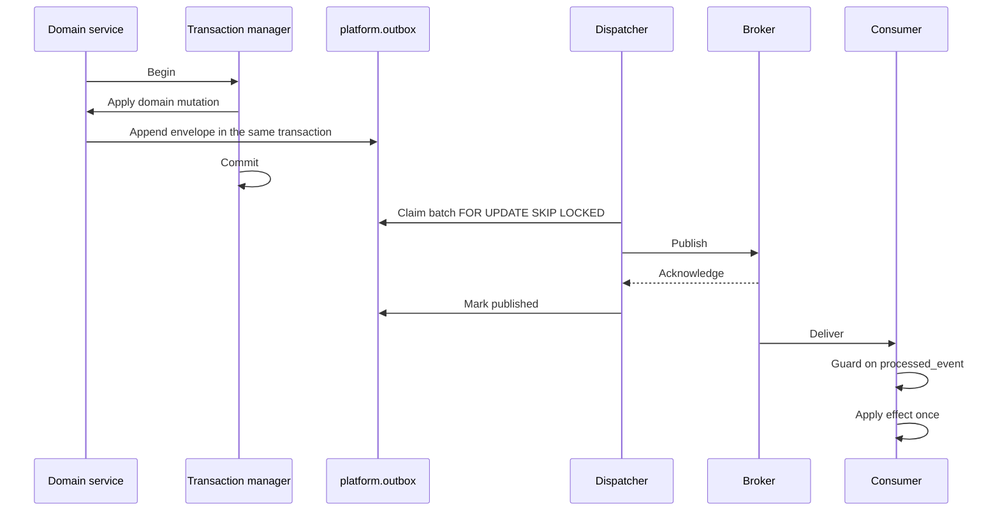

---
doc_meta:
  id: TDD-foundation-platform-001
  title: Transactional Outbox, Dispatcher, and Enterprise Event Envelope
  owner: Core Platform Team
  version: 1.1.0
  status: approved
  classification: restricted
  review_cycle_days: 90
  created_date: 2026-08-10
  last_reviewed: 2026-08-10
  parent_sad:
    - SAD-001
    - SAD-004
---

# Transactional Outbox, Dispatcher, and Enterprise Event Envelope

## Purpose

Specify the shared Go substrate that carries every domain event between the Identity
Control Service (SAD-001) and the Organization Control application
(SAD-004): the outbox table, the dispatcher that drains it, the CloudEvents envelope
that wraps each payload, and the consumer-side deduplication that makes at-least-once
delivery safe.

This substrate is the single mechanism by which a revocation reaches enforcement.
The propagation budget in the Membership revocation design — accept to outbox commit
within 100 ms, outbox commit to dispatch claim within 1 s — is a property of the code
specified here, not of either consuming system. Two divergent copies of this code
would produce two different enforcement intervals while both systems reported
compliance, which is why it is one versioned module rather than a pattern each
repository reimplements.

## Scope

**In scope**

- The `platform.outbox` table, its partitioning, and its ordering guarantee.
- The dispatcher: claim, publish, acknowledge, retry, and dead-letter behavior.
- The CloudEvents 1.0 envelope and the Scnehaux event type naming rule.
- The `platform.processed_event` deduplication table and the consumer guard.
- The `platform.idempotency_key` claim and replay path.
- RFC 7807 error serialization shared by both HTTP surfaces.

**Out of scope**

- Any domain concept. This module defines no Principal, Membership, Tenant, or
  Workspace type, and holds no domain state.
- Which events exist and what they mean — owned by the publishing system's designs.
- Broker product selection — recorded in SAD-001 and SAD-004.
- The Keycloak projection applied on receipt — owned by the Identity Control designs.

## Technical Context

Two systems compile this module. Neither shares a database, a process, or a
transaction with the other.

| System | Role | Database |
| :-- | :-- | :-- |
| `identity-control` (SAD-001) | Publishes `identity.*`, consumes `membership.*` and `tenant.*` | Control |
| `organization-control` (SAD-004) | Publishes `organization.*`, `tenant.*`, `membership.*`, consumes `identity.*` | Organization |

Each database carries its own `platform` schema. The two `platform` schemas are
unrelated and never joined; the shared name reflects shared code, not shared storage.

Three enterprise rules constrain the design and are treated as requirements rather
than as guidance:

1. **STD-GLB-004** mandates the CloudEvents 1.0 envelope, a UUID `event_id` as the
   outbox primary key, a `published` boolean, consumer deduplication keyed on
   `event_id`, three local retries with exponential backoff, and dead-letter routing.
   Its exception clause reads *None. All event-driven architecture rules apply
   unconditionally.*
2. **ADR-GLB-003** fixes polling with `FOR UPDATE SKIP LOCKED` as the Stage 1
   delivery mechanism and requires the outbox schema to leverage partitioning so
   processed blocks are truncated in bulk rather than deleted row by row.
3. **ADR-GLB-006** requires backward-compatible schema evolution, major version
   promotion inside the event type, and registration in the enterprise Schema
   Registry.

The design satisfies all three. Where an enterprise rule and an earlier draft of the
consuming designs disagreed, the enterprise rule wins and the consuming design is
corrected.

## Component Design

### Packages

| Package | Responsibility |
| :-- | :-- |
| `id` | UUIDv7 generation, parsing, and ordering; the canonical identifier form |
| `outbox` | Table access, dispatcher, lease management, retry and dead-letter routing |
| `event` | CloudEvents envelope construction, type naming, schema version binding |
| `inbox` | Deduplication guard over `platform.processed_event` |
| `idempotency` | Idempotency key claim, conflict detection, stored-response replay |
| `httpapi` | Routing, middleware, RFC 7807 problem serialization |
| `db` | Pool construction and the transaction manager that binds outbox writes to domain writes |
| `observability` | Tracing, metrics, structured logging, correlation propagation |

No package in this module imports a domain package, and no exported type carries
domain meaning. A type that names a business concept belongs in the owning system.

### Publication Path



The domain mutation and the outbox append share one transaction. A service that
mutates state and publishes in two transactions is a defect, and the test suite
injects a failure between the two to prove the rollback.

## Data Model

### Outbox

```sql
CREATE SEQUENCE platform.outbox_sequence AS BIGINT;

CREATE TABLE platform.outbox (
    event_id     UUID        NOT NULL DEFAULT gen_random_uuid(),
    sequence     BIGINT      NOT NULL DEFAULT nextval('platform.outbox_sequence'),
    event_type   TEXT        NOT NULL,
    aggregate_id UUID        NOT NULL,
    priority     SMALLINT    NOT NULL DEFAULT 100,
    payload      JSONB       NOT NULL,
    envelope     JSONB       NOT NULL,
    published    BOOLEAN     NOT NULL DEFAULT FALSE,
    published_at TIMESTAMPTZ,
    attempts     INTEGER     NOT NULL DEFAULT 0,
    last_error   TEXT,
    created_at   TIMESTAMPTZ NOT NULL DEFAULT now(),
    PRIMARY KEY (created_at, event_id)
) PARTITION BY RANGE (created_at);

CREATE INDEX outbox_unpublished
    ON platform.outbox (priority, sequence) WHERE published = FALSE;
```

`event_id` is the UUID identifier STD-GLB-004 requires, and it is the key consumers
deduplicate on. `published` is the mandated boolean and carries the partial index;
`published_at` records when, for latency measurement, and is never used as the
predicate.

`sequence` comes from a database sequence rather than an identity column so that it
stays monotonic across partitions. It supplies dispatch ordering and the snapshot
high-water mark that projection consumers resume from. It is a stream position, not
an entity identifier, so the prohibition on exposing sequential identifiers in
STD-GLB-002 does not apply to it.

Partitioning is required by ADR-GLB-003 so processed blocks are truncated in bulk.
The partition key appears in the primary key because PostgreSQL requires it. Daily
partitions are created ahead of time by a scheduled job, and partitions whose rows
are fully published and older than the retention window are dropped.

A `DEFAULT` partition exists so an insert never fails for want of one. The append runs
inside the caller's domain transaction, so a missing daily partition would abort a
membership revocation — a security state change lost because a scheduled job did not run.
That is worse than the cost the default partition carries, which is that attaching a new
range partition must first scan it for conflicting rows. Rows landing there are an
operational defect rather than a resting place, and a non-empty default is alerted at the
missing-future-partition threshold in §Operational Notes.

**Recorded deviation from STD-GLB-004.** That standard names `event_id` as the outbox
primary key and its exception clause reads *None*. PostgreSQL requires the partition
key in the primary key of a partitioned table, and a `UNIQUE (event_id)` constraint is
unavailable for the same reason, so `event_id` alone is not enforced unique here. The
two enterprise rules are in genuine tension, and partitioning wins because ADR-GLB-003
requires it and the alternative is row-by-row deletion on a hot table.

The deviation is contained rather than resolved. Consumers deduplicate against
`platform.processed_event`, where `event_id` is part of an enforced unique key, so
exactly-once processing does not depend on outbox uniqueness. A duplicate `event_id`
across two partitions would publish twice and be discarded once at each consumer. It is
recorded here because this design quotes STD-GLB-004's no-exception clause and then
takes one, and an unrecorded deviation is how a standard quietly stops meaning
anything.

### Deduplication

```sql
CREATE TABLE platform.processed_event (
    event_id     UUID        NOT NULL,
    consumer     TEXT        NOT NULL,
    event_type   TEXT        NOT NULL,
    processed_at TIMESTAMPTZ NOT NULL DEFAULT now(),
    PRIMARY KEY (event_id, consumer)
);
```

A consumer checks this table inside the same transaction that applies the effect. If
the insert conflicts, the delivery is acknowledged and discarded. Exactly-once
processing is achieved here, at the consumer, because the broker guarantees only
at-least-once delivery.

The key is `(event_id, consumer)` and not `event_id` alone. One deployable runs several
logical consumers over the same event: `identity-control` applies a context projection,
removes Keycloak sessions, and translates the event onward. With `event_id` as the sole
key, the first of those to record its row would cause every other one to observe a
conflict, return `first = false`, and **acknowledge the delivery without applying its
effect**. For a revocation event that is silent non-enforcement rather than an error,
which is the failure mode this key shape exists to prevent.

### Dead Letter

```sql
CREATE TABLE platform.dead_letter (
    event_id      UUID        PRIMARY KEY,
    event_type    TEXT        NOT NULL,
    envelope      JSONB       NOT NULL,
    payload       JSONB       NOT NULL,
    consumer      TEXT,
    failure_class TEXT        NOT NULL,
    failure_detail TEXT       NOT NULL,
    attempts      INTEGER     NOT NULL,
    first_failed_at TIMESTAMPTZ NOT NULL,
    dead_lettered_at TIMESTAMPTZ NOT NULL DEFAULT now(),
    resolved_at   TIMESTAMPTZ
);
```

A row here means an event was accepted by a domain transaction and never reached its
consumer. For a priority event that is a containment failure, so the alert on this
table is not a queue-depth alert.

`failure_class` is the field the dispatcher branches on, and only `poison` reaches this
table from the priority lane. Retention is bounded because the retained `envelope` and
`payload` carry restricted identity and organization context, and EAD-003 §5.4.5
prohibits indefinite retention:

- A resolved row is disposed after `DEAD_LETTER_RETENTION` measured from `resolved_at`.
- An unresolved row is never disposed. Its age is alerted at
  `DEAD_LETTER_MAX_UNRESOLVED_AGE` so the table forces escalation rather than
  accumulating undelivered security events.
- Disposal removes `envelope` and `payload` and retains `event_id`, `event_type`,
  `failure_class`, and timestamps, so the incident record survives the data it carried.

### Idempotency

```sql
CREATE TABLE platform.idempotency_key (
    key            TEXT        PRIMARY KEY,
    request_digest TEXT        NOT NULL,
    response_status INTEGER,
    response_body  JSONB,
    claimed_at     TIMESTAMPTZ NOT NULL DEFAULT now(),
    completed_at   TIMESTAMPTZ
);
```

A repeated key carrying a different `request_digest` is rejected with `409`. A
repeated key carrying the same digest replays the stored response without re-executing
the operation.

### Isolation Posture of the `platform` Schema

Row-Level Security is **deliberately not applied** to any table in this schema, and the
reason is a query model rather than an oversight. The dispatcher must claim every
unpublished row regardless of which tenant a payload concerns; a tenant predicate bound
from `app.tenant_id` would return zero rows to it. STD-GLB-002 §5.1 carves out exactly
this case as a store whose query model makes RLS inapplicable.

The consequence has to be stated rather than left implicit. `payload` and `envelope`
carry tenant-scoped data, so **this schema is a cross-tenant readable surface**. Its
protection is not row-level isolation but the boundary STD-GLB-002 §5.2 requires:

- the application runtime role does not own these tables and holds neither `SUPERUSER`
  nor `BYPASSRLS`;
- migration runs under a separate role and the runtime role holds no DDL privilege;
- no interface exposes a `platform` table to a tenant-facing caller, and no query path
  reaches it other than the dispatcher, the inbox guard, and the idempotency claim.

An implementer who adds RLS here breaks the dispatcher. An implementer who never
considers the exposure leaves a cross-tenant surface unexamined. Both outcomes come
from silence, which is why this subsection exists.

## API / Interface

### Envelope

Every published event conforms to CloudEvents 1.0 in JSON:

```json
{
  "specversion": "1.0",
  "id": "019235f4-2a17-7b98-8c31-5e0d7a9b4c62",
  "source": "/systems/organization-control",
  "type": "com.scnehaux.organization.membership.security.revoked",
  "time": "2026-08-10T09:14:22Z",
  "datacontenttype": "application/json",
  "dataschema": "https://schemas.scnehaux.com/organization/membership.security.revoked/1",
  "data": {
    "membership_id": "019235f5-...",
    "principal_id": "019235f1-...",
    "tenant_id": "019235f2-...",
    "membership_version": 15,
    "tenant_security_version": 3,
    "occurred_at": "2026-08-10T09:14:22Z",
    "correlation_id": "019235f6-...",
    "causation_id": "019235f7-..."
  }
}
```

`id`, `time`, and `type` are the CloudEvents fields. The aggregate version,
correlation, and causation identifiers the revocation design depends on live inside
`data`, where domain-specific fields belong. Nothing the earlier envelope carried is
lost; it is relocated to the layer that owns it.

### Type Naming

```text
com.scnehaux.<domain>.<aggregate>.<lifecycle>.<action>[.v<major>]
```

| Publisher | Example |
| :-- | :-- |
| `organization-control` | `com.scnehaux.organization.membership.security.revoked` |
| `organization-control` | `com.scnehaux.organization.tenant.lifecycle.activated` |
| `identity-control` | `com.scnehaux.identity.principal.lifecycle.activated` |

A breaking change promotes the type with a `.v2` suffix, per ADR-GLB-006. The absence
of a suffix means major version 1.

### Go Surface

```go
package outbox

// Append writes an event inside the caller's transaction. It is the only
// supported publication path; there is no direct broker client in this module.
func Append(ctx context.Context, tx db.Tx, aggregateID id.UUID, e event.Envelope, opt ...Option) error

// Priority marks an event for the reserved dispatch lane.
func Priority() Option
```

Two details of this signature were settled during implementation and are recorded here
because the earlier draft read differently.

`aggregateID` is a parameter and not an `Option`. The column is `NOT NULL` and its value
cannot be derived inside this package: the aggregate identifier lives in the payload,
whose shape only the publishing system knows. An option that every caller must supply is
an argument in the wrong clothes, and expressing it as one would let a caller omit it and
fail at the database instead of at the call site.

The handle is typed `db.Tx` rather than `pgx.Tx`. `db.Tx` is an alias for it, so nothing
changes at runtime, but the driver is then named in one package rather than in every
signature that carries a transaction. `arch.json` asserts that boundary, and this is the
signature it applies to.

```go
package inbox

// Guard registers the event as processed inside the caller's transaction and
// reports whether this delivery is the first. A false result means the effect
// has already been applied and the delivery must be acknowledged and dropped.
func Guard(ctx context.Context, tx pgx.Tx, consumer string, eventID uuid.UUID) (first bool, err error)
```

`Append` takes a transaction rather than opening one, which is what makes the atomic
guarantee structural: there is no way to publish outside a domain transaction.

### Problem Details

Every HTTP error is serialized per RFC 7807 as required by STD-GLB-001:

```json
{
  "type": "https://problems.scnehaux.com/idempotency-key-conflict",
  "title": "Idempotency key reused with a different request",
  "status": 409,
  "detail": "The key was first used with a different request body.",
  "instance": "/v1/principals",
  "correlation_id": "019235f6-..."
}
```

No secret, token, credential, or unrestricted personal data appears in any field.

## Algorithms / Logic

### Dispatch

```text
claim:
    SELECT ... FROM platform.outbox
    WHERE published = FALSE
    ORDER BY priority ASC, sequence ASC
    LIMIT :batch
    FOR UPDATE SKIP LOCKED

for each claimed row:
    publish to broker
    on acknowledgement:
        published = TRUE, published_at = now()
    on failure:
        classify: poison, or unavailable
        attempts = attempts + 1, record last_error and failure_class

        if failure_class = poison:
            -- invalid envelope, unserializable payload, unregistered type.
            -- retrying cannot help, so no attempts are spent on it.
            move to platform.dead_letter, mark published to stop redelivery
            raise the dead-letter alert

        else if attempts >= OUTBOX_MAX_ATTEMPTS:
            if priority = 0:
                reset attempts, release to the unpublished pool
                escalate the claim backoff, raise the undelivered-priority alert
            else:
                move to platform.dead_letter, mark published
                raise the dead-letter alert

        else:
            release for retry after backoff
```

Priority `0` carries security events and `100` carries lifecycle events. Two workers
are reserved for the priority lane so a lifecycle backlog cannot delay a revocation.

Retry uses exponential backoff with jitter, bounded at three local attempts per claim
as STD-GLB-004 requires. Empty polls back off so an idle dispatcher does not wake the
database on a fixed interval.

**Why a priority event is never dead-lettered for unavailability.** Dead-lettering is a
mechanism for poison messages: three attempts then abandon is calibrated for an event
that will never succeed. A broker outage is not that. Applying the poison rule to an
outage discards a revocation that would have published a minute later, and the
publisher cannot compensate — `organization-control` holds no Keycloak credential and
cannot enforce the change itself. So a priority event exhausts its three local attempts
per claim and then returns to the pool with escalating claim backoff, which honours the
standard's local-retry bound without abandoning the event.

**What bounds enforcement while the broker is down.** Not delivery. Each consumer
declares `max_accepted_age` and a `stale_behavior`, and a projection that exceeds its
accepted age under `fail_closed` denies. The enforcement bound during an outage is
therefore the consumer's staleness policy, not the dispatcher's success. Delivery
failure delays enforcement; it does not remove it.

That leaves exactly one unbounded path: a priority event dead-lettered as **poison**.
It is genuinely unbounded, it is a containment failure, and §Operational Notes alerts
it at any occurrence with no threshold.

Replicas contend safely because `SKIP LOCKED` lets each claim a disjoint batch.

### Consumption

```text
BEGIN
    first := inbox.Guard(consumer, envelope.id)
    if not first:
        COMMIT and acknowledge
    apply the effect
COMMIT
acknowledge
```

The guard and the effect share one transaction. Acknowledging before committing would
lose the effect on a crash; committing without the guard would apply it twice.

### Schema Registry

Every event type registers its JSON Schema. CI validates a new draft against the
registered history and fails the build on a backward-incompatible change: a removed
field, a changed type, or a new required property. Until the enterprise registry is
operational, `contracts/events/` in this repository holds the schemas and the same CI
check runs against the committed history. The location changes; the rule does not.

## Configuration

| Variable | Default | Purpose |
| :-- | :-- | :-- |
| `OUTBOX_DISPATCH_INTERVAL` | `500ms` | Poll interval, matching the ADR-GLB-003 Stage 1 target |
| `OUTBOX_BATCH_SIZE` | `100` | Rows claimed per cycle |
| `OUTBOX_WORKERS` | `4` | Standard-lane workers |
| `OUTBOX_PRIORITY_WORKERS` | `2` | Workers reserved for priority `0` |
| `OUTBOX_MAX_ATTEMPTS` | `3` | Local retries per claim, per STD-GLB-004 |
| `OUTBOX_PRIORITY_CLAIM_BACKOFF_MAX` | `30s` | Ceiling on claim backoff for a repeatedly failing priority row |
| `DEAD_LETTER_RETENTION` | `90d` | Age from `resolved_at` after which `envelope` and `payload` are removed |
| `DEAD_LETTER_MAX_UNRESOLVED_AGE` | `24h` | Age at which an unresolved row is alerted; unresolved rows are never disposed |
| `OUTBOX_BACKOFF_BASE` | `250ms` | Exponential backoff base with jitter |
| `OUTBOX_PARTITION_AHEAD` | `7d` | Days of partitions pre-created |
| `OUTBOX_RETENTION` | `30d` | Age after which fully published partitions are dropped |
| `BROKER_URL` | none, required | Broker endpoint, credentials scoped per deployable |

Each consuming system supplies its own values. The module reads no configuration
directly; the composition root of each deployable constructs and injects it.

## Testing Strategy

### Atomicity

- A domain mutation and its outbox append commit together; a failure injected between
  them rolls back both.
- A publication attempted outside a transaction fails to compile, because `Append`
  requires a transaction handle.

### Delivery

- A backlog of ten thousand priority-`100` rows does not delay a priority-`0` event
  beyond its budget.
- Two dispatcher replicas produce no duplicated publication and no starved row.
- Three consecutive publication failures classified `poison` move the row to
  `platform.dead_letter` with its failure class, attempt count, and first-failure
  timestamp.
- A **priority** row failing repeatedly with `unavailable` is never dead-lettered: it
  returns to the unpublished pool, its claim backoff escalates to the configured
  ceiling, and it publishes once the broker recovers.
- A **poison** classification dead-letters immediately without consuming retries.
- Backoff intervals grow exponentially and carry jitter.

### Deduplication

- Duplicate delivery of the same `event_id` produces exactly one effect.
- A consumer crash between effect and acknowledgement replays and produces no second
  effect.
- Two logical consumers in one deployable processing the same `event_id` each record
  their own `processed_event` row and each apply their effect exactly once. This is the
  case the composite key exists for, and a single-column key fails it.
- A resolved dead-letter row past `DEAD_LETTER_RETENTION` loses `envelope` and
  `payload` and retains its incident fields.
- An unresolved dead-letter row past `DEAD_LETTER_MAX_UNRESOLVED_AGE` is alerted and
  is not disposed.

### Envelope

- Every published event validates against CloudEvents 1.0 with all seven required
  fields present.
- Event types match the naming rule, and a type without a version suffix is treated as
  major version 1.
- A backward-incompatible schema draft fails CI.

### Partitioning

- A partition whose rows are all published and past retention is dropped, and no
  unpublished row is lost.
- A missing future partition is created before an insert would fail.

### Ordering

- `sequence` is strictly increasing across partition boundaries.
- A consumer resuming from a recorded high-water mark receives every later event and
  no earlier one.

## Security Notes

This module holds no credential and reaches no external system other than the broker
endpoint its host deployable configures. Broker credentials are scoped per deployable
in the secret manager, so a compromise of one deployable's configuration does not
yield the other's.

Event payloads carry restricted identity and organization context. Structured logs record
`event_id`, `event_type`, `correlation_id`, and `sequence`; they never record
`payload` or `data`. RFC 7807 problem documents carry no secret and no unrestricted
personal data.

A dead-lettered priority event means a security state change was accepted and never
enforced. It reaches that table only when classified poison, because unavailability
returns the row to the pool instead, and it is escalated as a containment failure
rather than triaged as a delivery error.

Retained `envelope` and `payload` in `platform.dead_letter` are the most sensitive
slice this module holds and sit in its least-observed table. Disposal after
`DEAD_LETTER_RETENTION` removes the payload and keeps the incident record, so the fact
of the failure outlives the data it carried.

## Performance Notes

The publication path adds one insert to an existing transaction. Dispatch cost is one
indexed partial scan per poll, bounded by batch size, against an index that only
covers unpublished rows and therefore stays small regardless of history.

Partition drops replace row-by-row deletion, which is what keeps autovacuum churn off
the hot table as ADR-GLB-003 requires.

The 500 ms poll interval sets a latency floor. Accept-to-claim is measured against the
1 s budget the revocation design allocates, and the floor consumes half of it, which
is why the interval is a security-relevant setting rather than a tuning preference.

## Operational Notes

| Signal | Warning | Critical |
| :-- | :-- | :-- |
| Oldest unpublished priority row | 30 s | 2 min |
| Oldest unpublished standard row | 5 min | 15 min |
| Dead-letter rows, priority events | any occurrence | any occurrence |
| Dead-letter rows, lifecycle events | any occurrence | 10 in an hour |
| Dispatcher lease age | 2 cycles | 10 cycles |
| Missing future partition | 2 days ahead | 1 day ahead |

Every metric, span, and log line carries `deployable` and `system` so load and failure
are attributable per consuming system while both run the same code.

Runbooks required before production: dead-letter triage and replay, dispatcher stall,
broker outage and backlog drain, partition creation failure, and duplicate-effect
investigation.

## Traceability

| Relationship | Target |
| :-- | :-- |
| Parent system | SAD-001 — Scnehaux Identity Runtime |
| Parent system | SAD-004 — Scnehaux Organization Control |
| Governed by | ADR-GLB-003 — Transactional Outbox, Stage 1 polling and partitioning |
| Governed by | ADR-GLB-006 — Event Versioning and Schema Evolution |
| Conforms to | STD-GLB-004 — CloudEvents envelope, deduplication, retry and dead-letter |
| Conforms to | STD-GLB-001 — RFC 7807 problem details |
| Conforms to | STD-GLB-002 — sequence is a stream position, not an entity identifier |
| Enterprise constraint | EAD-004 — commands, facts, and outcomes are distinct; mutations are duplicate-safe |
| Enterprise constraint | EAD-003 — private domain persistence; no cross-domain database access |
| Consumed by | Identity Control designs, for Keycloak projection and session removal |
| Consumed by | Organization Control designs, for membership authority and revocation |

### Open Questions

1. Broker product selection. EAD-005 delegates it to the realizing system, and
   STD-GLB-004 accepts Kafka, RabbitMQ, or an equivalent. The reserved priority lane
   is the deciding requirement: it must be expressible as a separate topic or stream
   with its own consumer group and its own capacity, without head-of-line blocking
   behind lifecycle traffic.
2. Whether `platform.dead_letter` remains a local table or is replaced by a broker
   dead-letter queue once the broker is selected. The local table survives a broker
   outage, which a broker-side queue does not, so the local table is retained until
   evidence justifies removing it.
