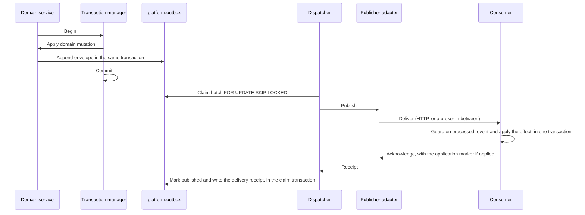

---
doc_meta:
  id: TDD-foundation-platform-001
  title: Transactional Outbox, Dispatcher, and Enterprise Event Envelope
  owner: Core Platform Team
  version: 1.5.0
  status: approved
  classification: restricted
  review_cycle_days: 90
  created_date: 2026-08-10
  last_reviewed: 2026-09-27
  parent_sad:
    - SAD-001
    - SAD-004
---

# Transactional Outbox, Dispatcher, and Enterprise Event Envelope

## Purpose

Specify the shared Go substrate that carries every domain event between the Identity
Control Service (SAD-001) and the Organization Control application
(SAD-004): the outbox table, the dispatcher that drains it, the CloudEvents envelope
that wraps each payload, and the consumer-side deduplication that makes at-least-once
delivery safe.

This substrate is the single mechanism by which a revocation reaches enforcement.
The propagation budget in the Membership revocation design — accept to outbox commit
within 100 ms, outbox commit to dispatch claim within 1 s — is a property of the code
specified here, not of either consuming system. Two divergent copies of this code
would produce two different enforcement intervals while both systems reported
compliance, which is why it is one versioned module rather than a pattern each
repository reimplements.

## Scope

**In scope**

- The `platform.outbox` table, its partitioning, and its ordering guarantee.
- The dispatcher: claim, publish, acknowledge, retry, release, and dead-letter behavior, and
  the database contract it verifies before starting.
- The `platform.dead_letter` incident record, including what a replay and a resolution need.
- The `platform.delivery_receipt` evidence record and the two evidence classes.
- The CloudEvents 1.0 envelope and the Scnehaux event type naming rule.
- The `platform.processed_event` deduplication table and the consumer guard.
- The `platform.idempotency_key` claim and replay path.
- RFC 7807 error serialization shared by both HTTP surfaces.

**Out of scope**

- Any domain concept. This module defines no Principal, Membership, Tenant, or
  Workspace type, and holds no domain state.
- Which events exist and what they mean — owned by the publishing system's designs.
- Delivery substrate selection. ADR-GLB-016 chooses a delivery profile per contract, and this
  module consumes it through the `Publisher` interface rather than a client.
- The Keycloak projection applied on receipt — owned by the Identity Control designs.
- Deciding whether a dead letter may be closed. This module stores the resolution record and
  refuses an incomplete one. The rule for when a closure is justified belongs to the publishing
  system (`TDD-organization-control-005`).

## Technical Context

Two systems compile this module. Neither shares a database, a process, or a
transaction with the other.

| System | Role | Database |
| :-- | :-- | :-- |
| `identity-control` (SAD-001) | Publishes `identity.*`, consumes `membership.*` and `tenant.*` | Control |
| `organization-control` (SAD-004) | Publishes `organization.*`, `tenant.*`, `membership.*`, consumes `identity.*` | Organization |

Each database carries its own `platform` schema. The two `platform` schemas are
unrelated and never joined; the shared name reflects shared code, not shared storage.

Three enterprise rules constrain the design and are treated as requirements rather
than as guidance:

1. **STD-GLB-004** mandates the CloudEvents 1.0 envelope, a UUID `event_id` as the
   outbox primary key, a `published` boolean, consumer deduplication keyed on
   `event_id`, three local retries with exponential backoff, and dead-letter routing.
   Its exception clause reads *None. All event-driven architecture rules apply
   unconditionally.*
2. **ADR-GLB-016** requires the publication intent to commit in the same local
   transaction as the authoritative mutation. It is relayed by polling with
   `FOR UPDATE SKIP LOCKED` from a partitioned table, so processed blocks are truncated
   in bulk rather than deleted row by row. It also separates transport acceptance from
   business completion, which is why this module records which one a delivery proved.
3. **ADR-GLB-006** requires backward-compatible schema evolution, major version
   promotion inside the event type, and registration in the enterprise Schema
   Registry.

The design satisfies all three. Where an enterprise rule and an earlier draft of the
consuming designs disagreed, the enterprise rule wins and the consuming design is
corrected.

## Component Design

### Packages

| Package | Responsibility |
| :-- | :-- |
| `id` | UUIDv7 generation, parsing, and ordering; the canonical identifier form |
| `outbox` | Table access, dispatcher, retry, release and dead-letter routing, delivery receipts, the dispatcher's database preflight, dead-letter retention helpers |
| `event` | CloudEvents envelope construction, type naming, schema version binding |
| `inbox` | Deduplication guard over `platform.processed_event` |
| `idempotency` | Idempotency key claim, conflict detection, stored-response replay |
| `httpapi` | Routing, middleware, RFC 7807 problem serialization |
| `db` | Pool construction and the transaction manager that binds outbox writes to domain writes |
| `observability` | Tracing, metrics, structured logging, correlation propagation |

No package in this module imports a domain package, and no exported type carries
domain meaning. A type that names a business concept belongs in the owning system.

### Publication Path


```mermaid
sequenceDiagram
    participant D as Domain service
    participant T as Transaction manager
    participant O as platform.outbox
    participant P as Dispatcher
    participant A as Publisher adapter
    participant C as Consumer

    D->>T: Begin
    T->>D: Apply domain mutation
    D->>O: Append envelope in the same transaction
    T->>T: Commit
    P->>O: Claim batch FOR UPDATE SKIP LOCKED
    P->>A: Publish
    A->>C: Deliver (HTTP, or a broker in between)
    C->>C: Guard on processed_event and apply the effect, in one transaction
    C-->>A: Acknowledge, with the application marker if applied
    A-->>P: Receipt
    P->>O: Mark published and write the delivery receipt, in the claim transaction
```

The adapter is the host's. Today the only one is `foundation-reference`'s
`dispatch.HTTPPublisher`, which is ADR-GLB-016's Direct Durable Delivery profile. A broker
adapter would sit in the same place and change nothing here, except that a broker cannot carry
the consumer's application marker, so every receipt it produced would be `transport_accepted`.

The domain mutation and the outbox append share one transaction. A service that
mutates state and publishes in two transactions is a defect, and the test suite
injects a failure between the two to prove the rollback.

## Data Model

### Outbox

```sql
CREATE SEQUENCE platform.outbox_sequence AS BIGINT;

CREATE TABLE platform.outbox (
    event_id     UUID        NOT NULL DEFAULT gen_random_uuid(),
    sequence     BIGINT      NOT NULL DEFAULT nextval('platform.outbox_sequence'),
    event_type   TEXT        NOT NULL,
    aggregate_id UUID        NOT NULL,
    priority     SMALLINT    NOT NULL DEFAULT 100,
    payload      JSONB       NOT NULL,
    envelope     JSONB       NOT NULL,
    published    BOOLEAN     NOT NULL DEFAULT FALSE,
    published_at TIMESTAMPTZ,
    attempts     INTEGER     NOT NULL DEFAULT 0,
    last_error   TEXT,
    failure_class   TEXT,
    first_failed_at TIMESTAMPTZ,
    next_attempt_at TIMESTAMPTZ,
    created_at   TIMESTAMPTZ NOT NULL DEFAULT now(),
    PRIMARY KEY (created_at, event_id)
) PARTITION BY RANGE (created_at);

CREATE INDEX outbox_unpublished
    ON platform.outbox (priority, sequence) WHERE published = FALSE;
```

`event_id` is the UUID identifier STD-GLB-004 requires, and it is the key consumers
deduplicate on. `published` is the mandated boolean and carries the partial index;
`published_at` records when, for latency measurement, and is never used as the
predicate.

Three columns were added during implementation because the dispatch algorithm below
cannot be expressed without them, and each is named by that algorithm or by a table it
writes to.

`next_attempt_at` is the earliest a failed row may be claimed again. STD-GLB-004 mandates
exponential backoff, and without this column the only way to express a delay is for the
worker to sleep — which would hold the claimed row's lock for the duration and turn a
delay for one event into a stall for its whole batch.

`first_failed_at` records when a row first failed to publish. `platform.dead_letter`
requires it `NOT NULL`, and by the time a row is dead-lettered its first failure is
several attempts in the past and cannot be reconstructed.

`failure_class` is the branch the dispatcher took, which the algorithm names alongside
`last_error`. It decides whether a row is retried or abandoned, so an operator reading a
stuck row needs to see which was chosen rather than infer it from a message.

`sequence` comes from a database sequence rather than an identity column so that it
stays monotonic across partitions. The same value is persisted in the envelope as the
CloudEvents extension `streamposition`; one SQL statement allocates and writes both, so
they cannot diverge. It supplies dispatch ordering and the snapshot high-water mark
projection consumers compare against. It is publisher-local, may contain gaps after a
rollback, and is neither an entity identifier nor a broker offset. The prohibition on
exposing sequential entity identifiers in STD-GLB-002 therefore does not apply to it.

Partitioning exists so processed blocks are truncated in bulk.
The partition key appears in the primary key because PostgreSQL requires it. Daily
partitions are created ahead of time by a scheduled job, and partitions whose rows
are fully published and older than the retention window are dropped.

A `DEFAULT` partition exists so an insert never fails for want of one. The append runs
inside the caller's domain transaction, so a missing daily partition would abort a
membership revocation — a security state change lost because a scheduled job did not run.
That is worse than the cost the default partition carries, which is that attaching a new
range partition must first scan it for conflicting rows. Rows landing there are an
operational defect rather than a resting place, and a non-empty default is alerted at the
missing-future-partition threshold in §Operational Notes.

**Recorded deviation from STD-GLB-004.** That standard names `event_id` as the outbox
primary key and its exception clause reads *None*. PostgreSQL requires the partition
key in the primary key of a partitioned table, and a `UNIQUE (event_id)` constraint is
unavailable for the same reason, so `event_id` alone is not enforced unique here. The
two enterprise rules are in genuine tension, and partitioning wins because the alternative
is row-by-row deletion on a hot table.

The deviation is contained rather than resolved. Consumers deduplicate against
`platform.processed_event`, where `event_id` is part of an enforced unique key, so
exactly-once processing does not depend on outbox uniqueness. A duplicate `event_id`
across two partitions would publish twice and be discarded once at each consumer. It is
recorded here because this design quotes STD-GLB-004's no-exception clause and then
takes one, and an unrecorded deviation is how a standard quietly stops meaning
anything.

### Deduplication

```sql
CREATE TABLE platform.processed_event (
    event_id     UUID        NOT NULL,
    consumer     TEXT        NOT NULL,
    event_type   TEXT        NOT NULL,
    processed_at TIMESTAMPTZ NOT NULL DEFAULT now(),
    PRIMARY KEY (event_id, consumer)
);
```

A consumer checks this table inside the same transaction that applies the effect. If
the insert conflicts, the delivery is acknowledged and discarded. Exactly-once
processing is achieved here, at the consumer, because the broker guarantees only
at-least-once delivery.

The key is `(event_id, consumer)` and not `event_id` alone. One deployable runs several
logical consumers over the same event: `identity-control` applies a context projection,
removes Keycloak sessions, and translates the event onward. With `event_id` as the sole
key, the first of those to record its row would cause every other one to observe a
conflict, return `first = false`, and **acknowledge the delivery without applying its
effect**. For a revocation event that is silent non-enforcement rather than an error,
which is the failure mode this key shape exists to prevent.

### Dead Letter

```sql
CREATE TABLE platform.dead_letter (
    event_id             UUID        PRIMARY KEY,
    event_type           TEXT        NOT NULL,
    envelope             JSONB,                -- nulled by disposal
    payload              JSONB,                -- nulled by disposal
    consumer             TEXT,                 -- not written by the dispatcher
    failure_class        TEXT        NOT NULL,
    failure_detail       TEXT        NOT NULL,
    attempts             INTEGER     NOT NULL,
    first_failed_at      TIMESTAMPTZ NOT NULL,
    dead_lettered_at     TIMESTAMPTZ NOT NULL DEFAULT statement_timestamp(),
    aggregate_id         UUID,                 -- what a replay re-appends under
    priority             SMALLINT,             -- which lane a replay re-enters
    resolved_at          TIMESTAMPTZ,
    resolution_type      TEXT,
    resolved_by          TEXT,
    resolution_reference TEXT,
    CONSTRAINT dead_letter_resolution_complete CHECK (
        (resolved_at IS NULL AND resolution_type IS NULL
            AND resolved_by IS NULL AND resolution_reference IS NULL)
     OR (resolved_at IS NOT NULL AND btrim(resolution_type) <> ''
            AND btrim(resolved_by) <> '' AND btrim(resolution_reference) <> ''))
);
```

A row here means an event was accepted by a domain transaction and never reached its
consumer. For a priority event that is a containment failure, so the alert on this table is
not a queue-depth alert.

`failure_class` is the field the dispatcher branches on, and only `poison` reaches this table
from the priority lane.

**A row can replay itself.** `aggregate_id` and `priority` are retained with the envelope, so a
replay is `outbox.Append(aggregate_id, envelope, Priority() when priority = 0)` from the row
alone. Without them a replay depended on the original outbox partition, which retention
removes, and the incident record would outlive the ability to act on it. Rows written before
these columns existed were backfilled from the outbox where it still held them. The rest stay
null, because a guessed `aggregate_id` names a real aggregate somewhere, and the replay would
deliver the event under the wrong subject.

**A closure is a record, not a timestamp.** `dead_letter_resolution_complete` refuses a
`resolved_at` without a type, an actor, and a reference to the evidence, and it refuses blank
values. Closing an incident without saying why is therefore impossible at the database, and
reopening one means clearing all four together. Which closures are justified is the publishing
system's rule, not this module's.

**`dead_lettered_at` names the transition.** It defaults to `statement_timestamp()` rather than
`now()`, so each row in a batch carries the moment it was dead-lettered, not the start of the
claim transaction. `first_failed_at` is still stamped with `now()`, which is a known imprecision
of at most one claim transaction.

Retention is bounded because the retained `envelope` and `payload` carry restricted identity and
organization context, and EAD-003 §5.4 prohibits indefinite retention:

- A resolved row is disposed after a retention period measured from `resolved_at`.
  `DisposeResolvedDeadLetters(tx, resolvedBefore)` nulls `envelope` and `payload`.
- An unresolved row is never disposed. `CountStaleUnresolvedDeadLetters(tx, olderThan)` feeds
  the alert, so the table forces escalation rather than accumulating undelivered security events.
- Disposal keeps everything but the two payload columns: the incident, its replay coordinates,
  and its resolution record. The fact of the failure, and of its closure, outlives the data it
  carried.

The host supplies both boundaries. This design's values are 90 days and 24 hours.

### Delivery Receipt

```sql
CREATE TABLE platform.delivery_receipt (
    event_id    UUID        NOT NULL,
    consumer    TEXT        NOT NULL,
    event_type  TEXT        NOT NULL,
    evidence    TEXT        NOT NULL
        CONSTRAINT delivery_receipt_evidence_check
        CHECK (evidence IN ('consumer_applied', 'transport_accepted')),
    recorded_at TIMESTAMPTZ NOT NULL DEFAULT statement_timestamp(),
    PRIMARY KEY (event_id, consumer)
);
```

One row per successful delivery to a named consumer, written in the same transaction that marks
the outbox row published. A failed publication writes none. The row says what the delivery
proved:

| Evidence | Meaning | Produced by |
| :-- | :-- | :-- |
| `consumer_applied` | The consumer committed the effect before acknowledging | Only `ReceiptFromMarker("applied")`, from the consumer's `X-Application-Receipt: applied` |
| `transport_accepted` | The transport took it, and nothing more is known | Everything else: no marker, an unrecognised marker, a broker |

The first receipt wins (`ON CONFLICT (event_id, consumer) DO NOTHING`), so a replay cannot weaken
evidence already recorded. `consumer` is `Config.Consumer`: the consumer's identity, not its
endpoint. An endpoint moves, and the question the receipt answers is whether this consumer holds
this event.

This is the table a dead-letter resolution trusts, and it is why the strong class is reachable
only through the consumer's marker.

**Retention.** A receipt is evidence that a closure was, or could be, justified. So deleting one
is bounded by what could still need it, not only by age. `PruneDeliveryReceipts(tx,
recordedBefore)` deletes a receipt only when all three conditions hold:

- **It is past the boundary.** A younger receipt is kept, so a resolution in progress finds it.
- **No dead letter is unresolved.** While any incident is open, nothing is pruned. Which receipt
  could close an incident is the publishing system's rule, not this module's. `REPLAYED` reads
  the event's own receipt, but `SUPERSEDED` reads a receipt for a different event, which this
  module cannot identify. So the only generic answer is to keep every receipt until the debt is
  closed.
- **No closure cites it.** A receipt named in a closure's `resolution_reference` is kept
  permanently, because the closure record is permanent. Disposal removes a dead letter's payload
  and never its resolution, and a resolution citing a receipt that no longer exists explains
  nothing.

The citation is recognised by its exact form, `platform.delivery_receipt:<event_id>:<consumer>`,
which names this module's table and key. `ReceiptReference(eventID, consumer)` builds it, and
hosts build the string there rather than restating it. A host writing the reference another way
keeps its closures but loses the protection. Pruning runs as the migration role. No runtime role
holds `DELETE` on evidence.

### Idempotency

```sql
CREATE TABLE platform.idempotency_key (
    scope          TEXT        NOT NULL,
    key            TEXT        NOT NULL,
    request_digest TEXT        NOT NULL,
    response_status INTEGER,
    response_body  JSONB,
    claimed_at     TIMESTAMPTZ NOT NULL DEFAULT now(),
    completed_at   TIMESTAMPTZ,
    PRIMARY KEY (scope, key)
);
```

A key is scoped to the authenticated caller. A repeated scoped key carrying a different
`request_digest` is rejected with `409`. A repeated scoped key carrying the same digest
replays the stored response without re-executing the operation. One caller cannot claim
or replay another caller's key.

### Isolation Posture of the `platform` Schema

Row-Level Security is **deliberately not applied** to any table in this schema, and the
reason is a query model rather than an oversight. The dispatcher must claim every
unpublished row regardless of which tenant a payload concerns; a tenant predicate bound
from `app.tenant_id` would return zero rows to it. STD-GLB-002 Multi-Tenancy & Isolation carves out exactly
this case as a store whose query model makes RLS inapplicable.

The consequence has to be stated rather than left implicit. `payload` and `envelope`
carry tenant-scoped data, so **this schema is a cross-tenant readable surface**. Its
protection is not row-level isolation but the boundary STD-GLB-002 Data Ownership & Access requires:

- the application runtime role does not own these tables and holds neither `SUPERUSER`
  nor `BYPASSRLS`;
- migration runs under a separate role and the runtime role holds no DDL privilege;
- no interface exposes a `platform` table to a tenant-facing caller, and runtime query
  paths reach it only through the dispatcher, inbox guard, and idempotency claim;
- partition maintenance reaches it only through the migration role, which already owns
  the DDL boundary.

An implementer who adds RLS here breaks the dispatcher. An implementer who never
considers the exposure leaves a cross-tenant surface unexamined. Both outcomes come
from silence, which is why this subsection exists.

## API / Interface

### Envelope

Every published event conforms to CloudEvents 1.0 in JSON:

```json
{
  "specversion": "1.0",
  "id": "019235f4-2a17-7b98-8c31-5e0d7a9b4c62",
  "source": "/systems/organization-control",
  "type": "com.scnehaux.organization.membership.security.revoked",
  "time": "2026-08-10T09:14:22Z",
  "datacontenttype": "application/json",
  "dataschema": "https://schemas.scnehaux.com/organization/membership.security.revoked/1",
  "streamposition": 10482,
  "data": {
    "membership_id": "019235f5-...",
    "principal_id": "019235f1-...",
    "tenant_id": "019235f2-...",
    "membership_version": 15,
    "tenant_security_version": 3,
    "occurred_at": "2026-08-10T09:14:22Z",
    "correlation_id": "019235f6-...",
    "causation_id": "019235f7-..."
  }
}
```

`id`, `time`, and `type` are CloudEvents fields. `streamposition` is the Scnehaux
CloudEvents extension assigned by the outbox and is mandatory at the broker boundary;
it is absent while domain code constructs the event. The aggregate version, correlation,
and causation identifiers the revocation design depends on live inside `data`, where
domain-specific fields belong.

### Type Naming

```text
com.scnehaux.<domain>.<aggregate>.<lifecycle>.<action>[.v<major>]
```

| Publisher | Example |
| :-- | :-- |
| `organization-control` | `com.scnehaux.organization.membership.security.revoked` |
| `organization-control` | `com.scnehaux.organization.tenant.lifecycle.activated` |
| `identity-control` | `com.scnehaux.identity.principal.lifecycle.activated` |

A breaking change promotes the type with a `.v2` suffix, per ADR-GLB-006. The absence
of a suffix means major version 1.

### Go Surface

```go
package outbox

// Append writes an event inside the caller's transaction. It is the only
// supported publication path; there is no direct broker client in this module.
func Append(ctx context.Context, tx db.Tx, aggregateID id.UUID, e event.Envelope, opt ...Option) error

// Priority marks an event for the reserved dispatch lane.
func Priority() Option

// Publisher is the host's delivery adapter. Wrapping ErrPoison marks a permanent refusal;
// any other error is unavailability.
type Publisher interface {
    Publish(ctx context.Context, e event.Envelope) (Receipt, error)
}

// Receipt carries the evidence class; its field is unexported, so the class is set only
// by these constructors.
func ReceiptFromMarker(marker string) Receipt // consumer_applied only for "applied"
func TransportReceipt() Receipt               // always transport_accepted

// NewDispatcher refuses a Config without a Consumer. Run verifies the database contract
// before any worker starts.
func NewDispatcher(pool *db.Pool, publisher Publisher, cfg Config) (*Dispatcher, error)
func CheckDispatcherPrerequisites(ctx context.Context, pool *db.Pool) error

// Retention helpers; the host supplies the boundaries.
func DisposeResolvedDeadLetters(ctx context.Context, tx db.Tx, resolvedBefore time.Time) (int64, error)
func CountStaleUnresolvedDeadLetters(ctx context.Context, tx db.Tx, olderThan time.Time) (int64, error)
func PruneDeliveryReceipts(ctx context.Context, tx db.Tx, recordedBefore time.Time) (int64, error)

// The resolution_reference form a closure uses to cite a receipt, and the form pruning protects.
func ReceiptReference(eventID, consumer string) string
```

Two details of this signature were settled during implementation and are recorded here
because the earlier draft read differently.

`aggregateID` is a parameter and not an `Option`. The column is `NOT NULL` and its value
cannot be derived inside this package: the aggregate identifier lives in the payload,
whose shape only the publishing system knows. An option that every caller must supply is
an argument in the wrong clothes, and expressing it as one would let a caller omit it and
fail at the database instead of at the call site.

The handle is typed `db.Tx` rather than `pgx.Tx`. `db.Tx` is an alias for it, so nothing
changes at runtime, but the driver is then named in one package rather than in every
signature that carries a transaction. `arch.json` asserts that boundary, and this is the
signature it applies to.

```go
package inbox

// Guard registers the event as processed inside the caller's transaction and
// reports whether this delivery is the first. A false result means the effect
// has already been applied and the delivery must be acknowledged and dropped.
func Guard(ctx context.Context, tx db.Tx, consumer string, eventID id.UUID, eventType event.Type) (first bool, err error)
```

`eventType` was added during implementation because `platform.processed_event.event_type`
is mandatory operational evidence and cannot be derived from `eventID`. Taking the
validated value object prevents the guard from persisting an invented or empty type.

`Append` takes a transaction rather than opening one, which is what makes the atomic
guarantee structural: there is no way to publish outside a domain transaction.

### Problem Details

Every HTTP error is serialized per RFC 7807 as required by STD-GLB-001:

```json
{
  "type": "https://problems.scnehaux.com/idempotency-key-conflict",
  "title": "Idempotency key reused with a different request",
  "status": 409,
  "detail": "The key was first used with a different request body.",
  "instance": "/v1/principals",
  "correlation_id": "019235f6-..."
}
```

No secret, token, credential, or unrestricted personal data appears in any field.

## Algorithms / Logic

### Dispatch

```text
before any worker starts:
    verify USAGE on platform, the three tables exist, and this role holds
    outbox SELECT+UPDATE, dead_letter INSERT+SELECT, delivery_receipt INSERT+SELECT
    any gap -> ErrPrerequisite, and no worker starts

claim:
    SELECT ... FROM platform.outbox
    WHERE published = FALSE
      AND (next_attempt_at IS NULL OR next_attempt_at <= now())
      AND (:any_lane OR priority = :lane)
    ORDER BY priority ASC, sequence ASC
    LIMIT :batch
    FOR UPDATE SKIP LOCKED

for each claimed row:
    an envelope that will not decode, disagrees with its sequence, or fails
    validation is poison without being published

    publish through the Publisher
    on success:
        published = TRUE, published_at = now()
        INSERT delivery_receipt (event_id, Config.Consumer, evidence) ON CONFLICT DO NOTHING
    on failure:
        class := poison if the error wraps ErrPoison, else unavailable
        attempts := attempts + 1          -- counted across claims, never reset
        record last_error (redacted) and failure_class

        decide:
            poison                               -> dead-letter
            attempts < MaxAttempts               -> retry after backoff
            priority = 0                         -> release after escalating backoff
            otherwise                            -> dead-letter

        dead-letter: copy to platform.dead_letter, mark published to stop redelivery
        retry, release: next_attempt_at := now() + backoff
```

| Class | Priority | attempts < MaxAttempts | attempts ≥ MaxAttempts |
| :-- | :-- | :-- | :-- |
| poison | any | dead-letter | dead-letter |
| unavailable | `0` (security) | retry | **release, never dead-letter** |
| unavailable | `100` (lifecycle) | retry | dead-letter |

Priority `0` carries security events and `100` carries lifecycle events. Two workers are
reserved for the priority lane so a lifecycle backlog cannot delay a revocation.

Retry uses exponential backoff with equal jitter, from `BackoffBase` doubling per attempt up to
`BackoffMax`, over the three local attempts STD-GLB-004 requires. Each claim is one attempt, and
the count accumulates across claims. Empty polls back off up to `IdleInterval`, so an idle
dispatcher does not wake the database on a fixed interval.

**Why a priority event is never dead-lettered for unavailability.** Dead-lettering is a
mechanism for poison messages: three attempts then abandon is calibrated for an event
that will never succeed. A broker outage is not that. Applying the poison rule to an
outage discards a revocation that would have published a minute later, and the
publisher cannot compensate — `organization-control` holds no Keycloak credential and
cannot enforce the change itself. So a priority event that exhausts its three local attempts
returns to the pool with escalating backoff, which honours the standard's local-retry bound
without abandoning the event.

The attempt count is kept on release rather than reset. What protects a priority row from being
abandoned is the decision rule, not the size of the number: `decide` returns *release* for a
priority row at any count, so the row can never reach dead-letter through unavailability.
Keeping the count lets the backoff grow toward `BackoffMax` instead of oscillating, and leaves an
operator able to see what an outage has cost.

**What bounds enforcement while the broker is down.** Not delivery. Each consumer
declares `max_accepted_age` and a `stale_behavior`, and a projection that exceeds its
accepted age under `fail_closed` denies. The enforcement bound during an outage is
therefore the consumer's staleness policy, not the dispatcher's success. Delivery
failure delays enforcement; it does not remove it.

That leaves exactly one unbounded path: a priority event dead-lettered as **poison**.
It is genuinely unbounded, it is a containment failure, and §Operational Notes alerts
it at any occurrence with no threshold.

Replicas contend safely because `SKIP LOCKED` lets each claim a disjoint batch.

**Claim, publish, and settle share one transaction**, so the row lock *is* the lease.
Another worker cannot take a row that is mid-publication, and a crashed dispatcher
releases its rows immediately rather than leaving them claimed until a lease expires. The
cost is that broker latency is spent holding locks, which `SKIP LOCKED` makes survivable:
a second worker steps over the locked rows rather than queueing behind them. If publish
latency ever approaches the claim budget, the alternative is a lease column and settlement
in a second transaction, which trades the recovery property away for shorter locks.

### Consumption

```text
BEGIN
    first := inbox.Guard(consumer, envelope.id)
    if not first:
        COMMIT and acknowledge
    apply the effect
COMMIT
acknowledge
```

The guard and the effect share one transaction. Acknowledging before committing would
lose the effect on a crash; committing without the guard would apply it twice.

### Schema Registry

Every event type registers its JSON Schema. CI validates a new draft against the
registered history and fails the build on a backward-incompatible change: a removed
field, a changed type, or a new required property. Until the enterprise registry is
operational, `contracts/events/` in this repository holds the schemas and the same CI
check runs against the committed history. The location changes; the rule does not.

## Configuration

The module reads no environment variable. Each deployable's composition root builds
`outbox.Config` and injects it:

| Field | Default | Purpose |
| :-- | :-- | :-- |
| `Consumer` | none, required | The consumer identity delivery receipts are keyed by |
| `Interval` | `500ms` | Poll interval, the Stage 1 polling target |
| `IdleInterval` | `5s` | Ceiling of the empty-poll backoff |
| `BatchSize` | `100` | Rows claimed per cycle |
| `Workers` | `4` | Standard-lane workers |
| `PriorityWorkers` | `2` | Workers reserved for priority `0` |
| `MaxAttempts` | `3` | Local attempts before dead-letter or release, per STD-GLB-004 |
| `BackoffBase` | `250ms` | Exponential backoff base, with jitter |
| `BackoffMax` | `30s` | Ceiling on backoff, including a repeatedly released priority row |

The host also supplies the maintenance boundaries. This design's values are:

| Boundary | Value | Purpose |
| :-- | :-- | :-- |
| Dead-letter retention | `90d` from `resolved_at` | After it, `envelope` and `payload` are removed |
| Unresolved dead-letter alert | `24h` | Unresolved rows are alerted, never disposed |
| Delivery-receipt retention | `90d` from `recorded_at` | After it, a receipt no closure cites is deleted, and only while no incident is open |
| Partitions ahead | `7d` | Days of partitions pre-created |
| Outbox retention | `30d` | Fully published partitions older than this are dropped |

## Testing Strategy

### Atomicity

- A domain mutation and its outbox append commit together; a failure injected between
  them rolls back both.
- A publication attempted outside a transaction fails to compile, because `Append`
  requires a transaction handle.

### Delivery

- A backlog of ten thousand priority-`100` rows does not delay a priority-`0` event
  beyond its budget.
- Two dispatcher replicas produce no duplicated publication and no starved row.
- A **poison** classification dead-letters on the first failure, with its failure class,
  attempt count, and first-failure timestamp.
- A **standard** row failing with `unavailable` is dead-lettered once its attempts are spent.
- A **priority** row failing repeatedly with `unavailable` is never dead-lettered. The decision
  function is asserted over 499 consecutive failures, and a database-backed row over 10: it
  returns to the pool, its backoff escalates to the ceiling, and it publishes once the consumer
  recovers.
- Backoff intervals grow exponentially and carry jitter.

### Evidence and Preflight

- The consumer's marker records `consumer_applied`. No marker, an unrecognised marker, or an
  unset receipt records `transport_accepted`.
- A failed publication leaves no receipt, and a replay does not weaken an existing one.
- The database refuses an undefined evidence class, and a dispatcher without a consumer is
  refused at construction.
- A dispatcher missing a required table or privilege refuses to start. One whose contract is met
  starts.
- A receipt past retention that nothing cites is pruned, and one inside retention is kept. A
  receipt a closure cites is never pruned. Nothing is pruned while an incident is open. A mutation
  removing either the citation clause or the open-incident clause turns its test red; both were
  observed.

### Dead-Letter Record

- A dead letter retains what a replay needs, and can be replayed after the original partition is
  gone.
- The backfill recovers what the outbox still holds and leaves the rest null.
- `dead_lettered_at` names each row's own transition, not the transaction start.
- A timestamp alone cannot close an incident. Partial and blank resolutions are refused, and
  reopening must clear the whole record.

### Deduplication

- Duplicate delivery of the same `event_id` produces exactly one effect.
- A consumer crash between effect and acknowledgement replays and produces no second
  effect.
- Two logical consumers in one deployable processing the same `event_id` each record
  their own `processed_event` row and each apply their effect exactly once. This is the
  case the composite key exists for, and a single-column key fails it.
- A resolved dead-letter row past its retention boundary loses `envelope` and `payload` and
  retains its incident fields.
- An unresolved dead-letter row past the alert boundary is counted and is not disposed.

### Envelope

- Every published event validates against CloudEvents 1.0 with all seven required
  fields present.
- Every published event carries a positive `streamposition`; the value equals the
  `platform.outbox.sequence` of its stored row.
- Event types match the naming rule, and a type without a version suffix is treated as
  major version 1.
- A backward-incompatible schema draft fails CI.

### Partitioning

- A partition whose rows are all published and past retention is dropped, and no
  unpublished row is lost.
- A missing future partition is created before an insert would fail.

### Ordering

- `sequence` is strictly increasing across partition boundaries.
- A snapshot high-water mark and buffered events with greater `streamposition`
  reconstruct authority without a gap. Sequence gaps do not fail reconstruction.

## Security Notes

This module holds no credential and reaches no external system other than the broker
endpoint its host deployable configures. Broker credentials are scoped per deployable
in the secret manager, so a compromise of one deployable's configuration does not
yield the other's.

Event payloads carry restricted identity and organization context. Structured logs record
`event_id`, `event_type`, `correlation_id`, and `sequence`; they never record
`payload` or `data`. RFC 7807 problem documents carry no secret and no unrestricted
personal data.

A dead-lettered priority event means a security state change was accepted and never
enforced. It reaches that table only when classified poison, because unavailability
returns the row to the pool instead, and it is escalated as a containment failure
rather than triaged as a delivery error.

Retained `envelope` and `payload` in `platform.dead_letter` are the most sensitive
slice this module holds and sit in its least-observed table. Disposal after the retention
boundary removes the payload and keeps the incident record, so the fact of the failure
outlives the data it carried.

`platform.delivery_receipt` is evidence, and evidence a writer can edit is not evidence. The
dispatcher's role needs `INSERT` and `SELECT` on it (the latter because `ON CONFLICT` requires
it), and no runtime role needs `UPDATE` or `DELETE`. Each host grants accordingly;
`organization-control` does and asserts it. Retention deletes under the migration role, which owns
the table, and never a receipt a closure cites.

## Performance Notes

The publication path adds one insert to an existing transaction. Dispatch cost is one
indexed partial scan per poll, bounded by batch size, against an index that only
covers unpublished rows and therefore stays small regardless of history.

Partition drops replace row-by-row deletion, which is what keeps autovacuum churn off
the hot table.

The 500 ms poll interval sets a latency floor. Accept-to-claim is measured against the
1 s budget the revocation design allocates, and the floor consumes half of it, which
is why the interval is a security-relevant setting rather than a tuning preference.

## Operational Notes

| Signal | Warning | Critical |
| :-- | :-- | :-- |
| Oldest unpublished priority row | 30 s | 2 min |
| Oldest unpublished standard row | 5 min | 15 min |
| Dead-letter rows, priority events | any occurrence | any occurrence |
| Dead-letter rows, lifecycle events | any occurrence | 10 in an hour |
| Unresolved dead letter age | 24 h | 24 h, priority events |
| Missing future partition | 2 days ahead | 1 day ahead |

There is no lease signal, because there is no lease column: the claim transaction's row lock is
the lease, and a crashed dispatcher releases its rows at once.

Every metric, span, and log line carries `deployable` and `system` so load and failure
are attributable per consuming system while both run the same code.

Runbooks required before production: dead-letter triage and replay, dispatcher stall,
broker outage and backlog drain, partition creation failure, and duplicate-effect
investigation.

## Traceability

| Relationship | Target |
| :-- | :-- |
| Parent system | SAD-001 — Scnehaux Identity Runtime |
| Parent system | SAD-004 — Scnehaux Organization Control |
| Governed by | ADR-GLB-016 — source-local outbox, delivery profiles, transport acceptance distinct from business completion |
| Governed by | ADR-GLB-006 — Event Versioning and Schema Evolution |
| Conforms to | STD-GLB-004 — CloudEvents envelope, deduplication, retry and dead-letter |
| Conforms to | STD-GLB-001 — RFC 7807 problem details |
| Conforms to | STD-GLB-002 — sequence is a stream position, not an entity identifier |
| Enterprise constraint | EAD-004 — commands, facts, and outcomes are distinct; mutations are duplicate-safe |
| Enterprise constraint | EAD-003 — private domain persistence; no cross-domain database access |
| Consumed by | Identity Control designs, for Keycloak projection and session removal |
| Consumed by | Organization Control designs, for membership authority, revocation, and dead-letter resolution (`TDD-organization-control-005`) |

### Delivery Profiles

ADR-GLB-016 selects a delivery profile per contract rather than one broker for the enterprise.
What that means for this module:

- **The `Publisher` interface is the seam.** The adapter satisfying it lives in each host, and
  this module holds no broker client. Membership security events currently use Direct Durable
  Delivery over HTTP (`foundation-reference`'s `dispatch.HTTPPublisher`).
- **The dead letter stays local.** `platform.dead_letter` covers outbox-to-consumer publication.
  It survives a broker outage, and it is the incident record dead-letter resolution is built on,
  so it stays whichever profile a contract uses.
- **The stream profile adds three constraints**, if a contract ever takes it:
  - The priority lane becomes a separate topic, selected by `priority = 0`, rather than a field
    inside one topic.
  - Producers partition by `aggregate_id`, because a log preserves order only within a
    partition. Consumers already tolerate cross-aggregate reordering, since they reconcile by
    authority version and deduplicate on `event_id`.
  - Receipts degrade to `transport_accepted`, because a broker cannot carry the consumer's
    application marker.
- **Schemas.** `contracts/events` and `tools/schemacheck` are the interim schema registry, with
  the compatibility check running in CI. The interim state is recorded as debt in `ROADMAP.md`.
